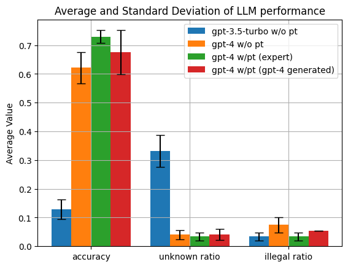

各LLMがPostgreSQLに関する知識をどの程度有しているかに関しての調査記録

## 簡易測定（GPT-4とGPT3.5）

 - 評価概要
   - [PostgreSQLに関する4択（正解は1つのみ）の問題](./generated/questions/postgres_questions_ossdb_exams.toml)を解かせて、4つの回答候補に対応した1から4の数字を出力するように指示
   - もし問題がわからない場合には、0を出力するように指示
   - 評価対象
     - `gpt-3.5-turbo w/o pt`
       - OpenAI APIの`gpt-3.5-turbo`を使用してプロンプト調整（Prompt Tuning）をせずに問題文を解かせたケース
     - `gpt-4 w/o pt`
       - `gpt-3.5-turbo w/o pt`と同様の条件でモデルを`gpt-4`に変更したケース
     - `gpt-4 w/pt (expert)`
       - `gpt-4`を使用して、自作の[PostgreSQLの専門家である旨を伝えるプロンプト](./generated/prompts/postgres_expert_prompt.txt)を与えて問題文を解かせたケース
     - `gpt-4 w/pt (gpt-4 generated)`
       - `gpt-4 w/pt (expert)`と同様の条件でプロンプトを[GPT-4を使って自動生成したもの](./generated/prompts/gpt4_generated.txt)に置き換えたケース
   - 評価観点
     - `accuracy`
       - 問題文を正しく回答できている割合
     - `unknown ratio`
       - 問題文がわからない場合に0を出力している割合
     - `illegal ratio`
       - 出力制約の0から4の数字以外を出力している割合

 - 評価結果（試行回数が少ないので、適宜更新）

## TODO

 - [PostgreSQLに関する問題文](./generated/questions/postgres_questions_ossdb_exams.toml)の見直し
 - 各リリースノートから、各リリース固有の問題文の生成と評価
    - どのリリースまでに関する知識を有しているかの評価のために使用
 - 評価結果の試行回数を増やす
   - GPT-4高い・・・
 - オープンなLLMの評価
 - モデル依存だと考えられるプロンプトの調整をどうするか？
   - PostgreSQLに関する質問をする場合に汎用的に使用できるテンプレートがほしい
