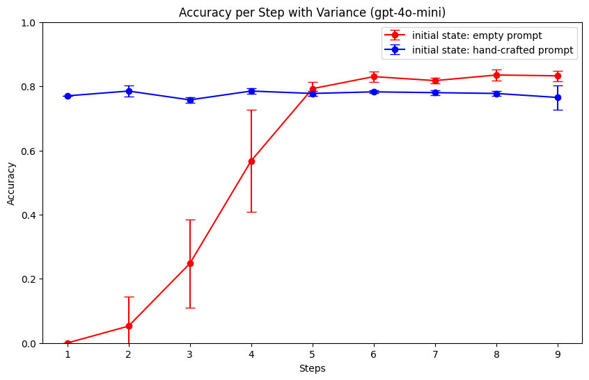

各LMがPostgreSQLに関する知識をどの程度有しているかに関しての調査作業メモ

## 簡易測定（GPT-4とGPT3.5）

 - 評価概要
   - [PostgreSQLに関する4択（正解は1つのみ）の問題](./generated/questions/postgres_questions_ossdb_exams.toml)を解かせて，4つの回答候補に対応した1から4の数字を出力するように指示
   - もし問題がわからない場合には，0を出力するように指示
   - 評価対象
     - `gpt-3.5-turbo w/o pt`
       - OpenAI APIの`gpt-3.5-turbo`を使用してプロンプト調整（Prompt Tuning）をせずに問題文を解かせたケース
     - `gpt-4 w/o pt`
       - `gpt-3.5-turbo w/o pt`と同様の条件でモデルを`gpt-4`に変更したケース
     - `gpt-4 w/pt (expert)`
       - `gpt-4`を使用して，自作の[PostgreSQLの専門家である旨を伝えるプロンプト](./generated/prompts/postgres_expert_prompt.txt)を与えて問題文を解かせたケース
     - `gpt-4 w/pt (gpt-4 generated)`
       - `gpt-4 w/pt (expert)`と同様の条件でプロンプトを[GPT-4を使って自動生成したもの](./generated/prompts/gpt4_generated.txt)に置き換えたケース
   - 評価観点
     - `accuracy`
       - 問題文を正しく回答できている割合
     - `unknown ratio`
       - 問題文がわからない場合に0を出力している割合
     - `illegal ratio`
       - 出力制約の0から4の数字以外を出力している割合

 - 評価結果（試行回数が少ないので，適宜更新）

<p align="center"></p>

## プロンプトの自動最適化

 - LM共通で使用できるプロンプトを設定することは難しそう [5]、ということなのでプロンプトの自動最適化を調査
 - プロンプトの自動最適化に関する論文（参考にした論文リストは下記に記載）やコードを調べたところGoogle DeepMindの[opro](https://github.com/google-deepmind/opro) [2]か，Microsoft Azure AIの[ProTeGi](https://github.com/microsoft/LMOps/tree/main/prompt_optimization) [1]あたりが現在のSoTAに近い手法の様子
   - ただ両者の精度比較をした論文は未発見，要調査
 - 内部で使用されているmeta promptなどの日本語化や改良を行いやすい観点でいうとProTeGiのコードほうが良いと感じたため，ProTeGiを今回の評価に使えるように[改変](https://github.com/microsoft/LMOps/compare/main...maropu:LMOps:main)
   - 今後もこれをベースに，他の論文の手法を取り入れつつ改良したい
 - とりあえず上記の改変コードを用いて簡単な評価を実施
   - 訓練/評価データ
     - LMによる生成と手作業での確認/改良により作成した[PostgreSQLに関する100個の問題](https://github.com/maropu/postgres_llm_eval/blob/master/generated/questions/postgres_questions.toml)
       - 問題の品質改善は今後の課題
   - 評価モデル
     - `gpt-4o-mini`（`gpt-4`が高いため，今回は廉価版のモデルを利用）
   - 評価パタン
     - `initial state: empty prompt`
       - 初期のプロンプトを与えず，ゼロからLMに最適なプロンプトを生成させるケース
     - `initial state: hand-crafted prompt`
       - 初期のプロンプトとして自作の[PostgreSQLの専門家である旨を伝えるプロンプト](./generated/prompts/postgres_expert_prompt_optimized.txt)を与えるケース
   - 評価結果のメモ
     - 自作のプロンプトの精度はほぼ変化がない，一方ゼロからLMにプロンプトを考えるケースは最終的に自作のプロンプトより精度が良くなっている点が面白い
     - 定常的に上記のように傾向が得られるかどうかは要調査

<p align="center"></p>

 - LMがゼロから生成したものの中で最も精度が高かったプロンプト（Accuracy: 0.86）

```
以下の質問に対して，最も適切と思われる選択肢を選び，その番号を記入してください。
選択肢を注意深く検討し，専門用語や技術的な側面に基づいてくれぐれも慎重に判断してください。
選択肢が特定の技術やプロセスに関連する場合は，あなたの理解に基づいた適切な評価を行ってください。

質問: [質問内容をここに挿入]

選択肢:
[1] [選択肢1]
[2] [選択肢2]
[3] [選択肢3]
[4] [選択肢4]

あなたが選択した理由についても考慮し，専門的視点からの判断を示してください。
数字のみでお答えください。また，各選択肢に関する背景や関連技術の理解が重要なので，できるだけ深く考察を行ってください。
```

 - 自作のプロンプトを与えて最適化させたものの中で最も精度が高かったプロンプト（Accuracy: 0.79）

```
あなたはPostgreSQLの専門家です。10年以上にわたり，PostgreSQLに関連するサポート業務を提供しており，
顧客からの問い合わせに対して高精度な回答をしてきました。
以下の基準に従って，与えられた質問にお答えください。

質問は特定の状況や条件に基づいており，その選択肢は微妙だが重要な違いがあります。
したがって，次の点に特に注意して選択を行ってください。\

- 各選択肢の内容を相互に比較し，それぞれの選択肢が質問に対してどういう意味を持つのかを慎重に考慮してください。選択肢について具体的に考える時間を取ってください。
- 正しい情報を基に，選択肢の間の相違点や重要性を踏まえて，最も適切な選択肢を選ぶ必要があります。
- 質問の内容が選択肢によって明確に回答可能である場合，正しい選択肢の番号（1, 2, 3, 4のいずれか）を半角数字で示してください。
- 回答できない場合や，選択肢が不適切であると判断した場合は，半角数字の0を示してください。
- 他の文字や記号を出力してはいけません。

以下は，質問の例です。各質問に対してルールに従って回答してください。
```

 - 参考論文/記事
   - [1] Reid Pryzant et al., "Automatic Prompt Optimization with "Gradient Descent" and Beam Search", Proceedings of EMNLP, 2023.
     - Microsoft Azure AIの[ProTeGi](https://github.com/microsoft/LMOps/tree/main/prompt_optimization)の論文，機械学習における勾配を用いた最適化を模してプロンプトの最適化手順を構築，[4]と類似のparaphrasingや，banditアルゴリズムによるスコアの高いtop-k候補プロンプトの効率的な選択を実施
   - [2] Chengrun Yang et al., "Large language models as optimizers", arXiv preprint arXiv:2309.03409, 2023.
     - Google DeepMindの[opro](https://github.com/google-deepmind/opro)の論文（preprint），プロンプト候補を生成する際にmeta promptとして過去スコアが高かったプロンプトの履歴をスコアと共に与える手法
   - [3] Taylor Shin et al., "AUTOPROMPT: Eliciting Knowledge from Language Models with Automatically Generated Prompts", Proceedings of EMNLP, 2020.
     - Masked LMにおいて，与えられた`[MASK]`を含む入力文の中に，損失関数が最小となるようなtoken列（trigger tokens）を計算して挿入する手法，アプローチは面白いがLMの内部状態（モデルパラメータ）を参照できる前提の最適化なので，採用が難しい
   - [4] Yongchao Zhou et al., "LARGE LANGUAGE MODELS ARE HUMAN-LEVEL ENGINEERS", Proceedings of ICLR, 2023.
      - LMに入出力例（examples/demonstrations）からプロンプトを生成させて、定義したスコアが高いもの選択する処理を繰り返すことでプロンプトを改善する手法、モンテカルロ法によるparaphrasingや、複数あるプロンプト候補からスコアの高いプロンプトを効率的に選択するために評価データの部分集合を段階的に適用する工夫を実施
   - [5] Dina Genkina, "AI Prompt Engineering Is Dead", IEEE Spectrum, 2024, https://spectrum.ieee.org/prompt-engineering-is-dead
      - LM共通のプロンプト戦略はなく，特定のプロンプトとLMの組み合わせ固有のものである可能性が高い，という話

## TODO

 - [PostgreSQLに関する問題文](./generated/questions/postgres_questions.toml)の改善
   - 現状訓練と評価データが同一になっているため，それぞれ異なる問題を作成する必要がある
   - 過去研究で，訓練データに対する過学習が起こりにくい，みたいな話題もあるため，このあたりの挙動は要調査
 - 各リリースノートから，各リリース固有の問題文の生成と評価
    - どのリリースまでに関する知識を有しているかの評価のために使用
 - 評価結果の試行回数を増やす
   - GPT-4高い・・・
 - オープンなLMの評価
